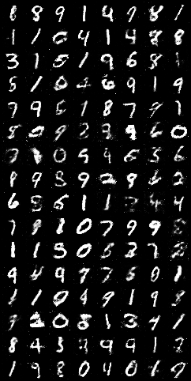

# Digit Generator

- This project aims as a beginner's guide to GANs to generate images. It generates images for the MNIST dataset.
- For now, it simply uses basic linear layers as both the generator and discriminator.
- Image generated after the 186th epoch: \

- The model has been saved in the `models/` directory (till the 187th epoch, more details can be found in `main.ipynb`)
- Images will be generated in the `samples/` directory.

### Future goals with this project

- Use DCGANs to implement this.
- Use different loss functions to figure out if it is easier to train and generalise.
- Try and tune the hyperparameters better.
